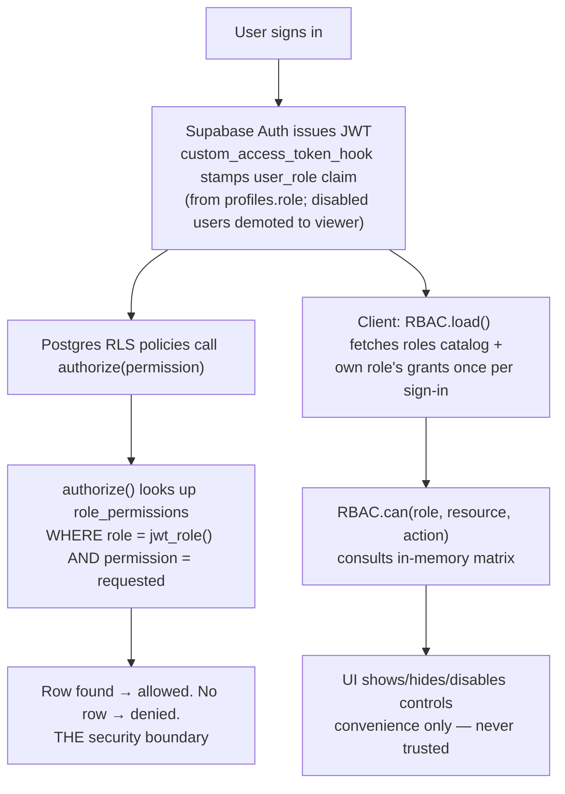
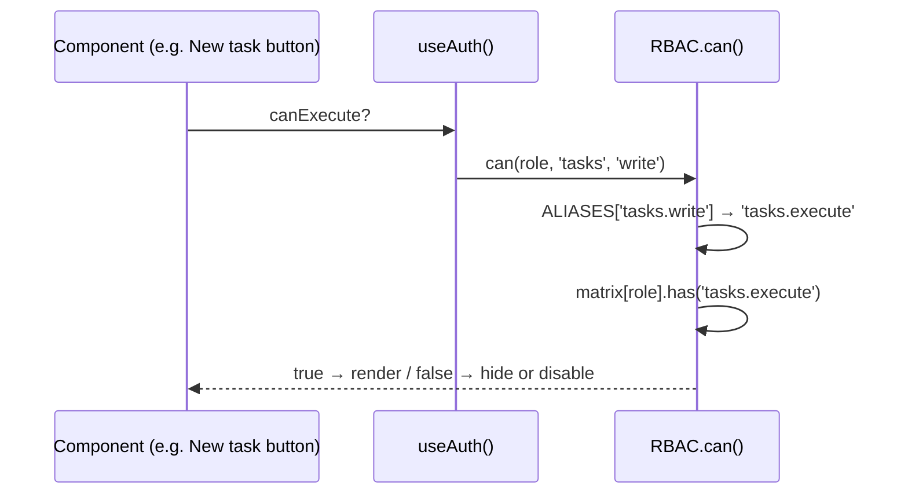
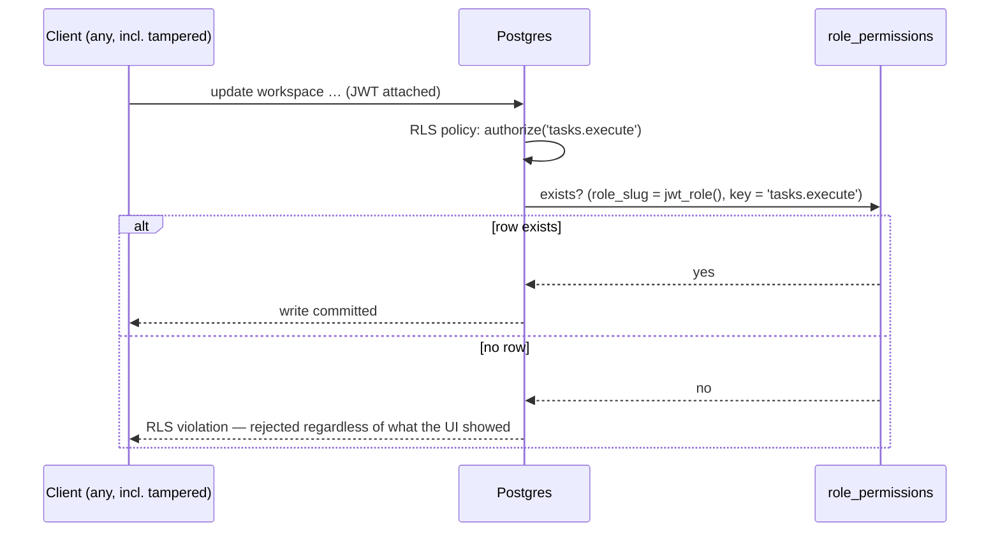
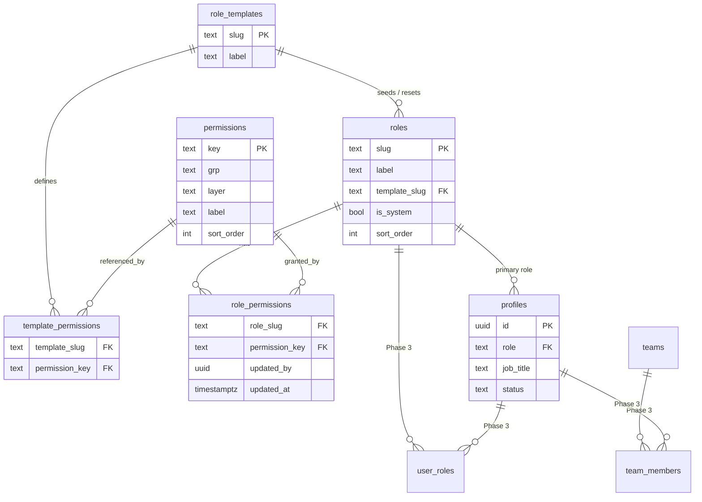

# Technical Design — Roles & Permissions Administration

**Product:** FM Navigate Execution Hub
**Doc status:** **Approved with recommendations** — rev 0.3, 2026-07-17
**Author:** Vihan Mapalagama (drafted with Claude)
**Depends on:** PRD-EXECUTION-HUB-v1.md (approved baseline), RBAC Phase 1 (branch `jira-style-permissions`, commits `1929506`/`c0e56df`)

**rev 0.2:** Authorization Architecture (§3) with sequence diagrams, capability layers, Business Rules (§8), `tasks.write → tasks.execute` rename + alias map, dashboards demoted from permissions to views, navigation derived from permissions (decision record), feature flags / departments / object roles scoped as future concepts.
**rev 0.3 (review round 2):** job titles separated from security roles (`executive` role, "Managing Director" becomes a `profiles.job_title`); dedicated `role_templates` / `template_permissions` tables replace the jsonb column; permissions/actions/audit-events distinction (§3.4); dashboards redefined as permission-filtered widget compositions (§7.3); `role_permissions` read narrowed to own-role (non-admins); "Domain ownership" renamed Object Roles; condition-based permissions added to open questions; feature flags moved to Appendix A.
**rev 0.4 (implementation):** honest enforcement boundary added (§2.1) — the catalog ships the full target shape but only 14 keys are wired end-to-end in Phase 2; the rest are marked `enforced = false` and shown read-only ("Planned") in the admin UI. Also records the two implementation-time security fixes: per-user matrix cache isolation (§7.1) and the `reset_role_to_template` self-lockout fix (§6.4).

---

## 2.1 Enforcement boundary — what Phase 2 actually gates (READ THIS)

The permission **catalog** (`permissions`, 41 keys) is the forward-compatible
target shape. Phase 2 **wires only the subset that has a real end-to-end effect
today**; the admin matrix marks every other key **Planned** and disables its
checkbox, because toggling an unwired key would change nothing and the UI must
not pretend otherwise. The wired set is the `enforced = true` column, set
canonically in `supabase/schema.sql`, and is code-audited — not assumed.

**Enforced today (14):**

| Key | Wired by |
|---|---|
| `tasks.read` | nav item + every dashboard-widget filter |
| `tasks.execute` | `canExecute` (task work) **and** RLS `authorize('tasks.execute')` on workspace + storage writes |
| `tasks.assign` | `canAssign` — task owner field |
| `tasks.prioritize` | `canPrioritize` — priority field |
| `tasks.delete` | `canDeleteTask` — delete control |
| `deliverables.read` | nav item + Deliverables dashboard widget |
| `weekly.read` | nav item (This Week) |
| `kpi.read` | nav item (KPI Scorecard) |
| `reports.read` | nav item (Weekly Summary) |
| `admin.workspace` | `canEdit` — governance surfaces (import, New task in topbar, deliverable/week/KPI edits) |
| `admin.permissions` | Roles & Permissions admin card + RLS on `role_permissions` |
| `users.assign_roles` | Users admin card + RLS on `profiles` (role/status changes) |
| `comments.write` | RLS `authorize('comments.write')` — comment insert |
| `comments.moderate` | RLS `authorize('comments.moderate')` — edit/delete others' comments |

**Planned / not enforced (27):** `tasks.create`, `tasks.edit`, `tasks.link`,
`tasks.approve`; all non-read `deliverables.*`; `weekly.write_own`,
`weekly.write_team`, `weekly.approve`; `kpi.write`, `kpi.approve`;
`reports.generate`, `reports.export`; `comments.read`; `users.read`,
`users.invite`, `users.disable`, `users.delete`; `admin.backups`,
`admin.restore`, `admin.settings`, `admin.audit_log`; `dashboard.executive`,
`dashboard.view_all`.

Rationale for the split: today task creation/field edits are gated by the
coarse `canEdit`/`canExecute` flags (not by dedicated `tasks.create`/`.edit`
checks); deliverables/weekly/KPI writes are gated by `admin.workspace`, not by
their own keys; reads other than the five nav-driving ones gate nothing
(reads are open to any signed-in user); and the invite/disable/delete/backup/
restore/audit/dashboard surfaces have no control or RLS behind them yet. Each
becomes `enforced = true` in the SAME migration slot when its wiring lands —
no catalog churn, no UI rewrite. This is the honest expression of the Phase-1
limit already documented in §2: the workspace is one jsonb blob, so the DB can
only gate the coarse `tasks.execute` write; the finer keys wait for
normalisation.

---

## 1. Summary

Today permissions are **hardcoded**: a static `PERMISSIONS` map in `fm-navigate/permissions.js` (client convenience) mirrored by role literals baked into RLS policies in `supabase/schema.sql` (security boundary). Changing what a Business Analyst can do requires a code deploy **and** a SQL migration.

This design moves permissions into **data**: a `roles` / `permissions` / `role_permissions` schema in Supabase, a generic `authorize(permission)` function that RLS policies call instead of hardcoded role lists, and an owner-only **Settings → Roles & Permissions** admin page (Jira-style matrix). Role *templates* remain the starting point; owners can then toggle individual permissions per role without deploys.

The rollout is phased exactly as agreed with stakeholders:

| Phase | Scope | Deploy needed to change a permission? |
|---|---|---|
| **1 (shipped)** | Fixed role templates, hardcoded | Yes (code + SQL) |
| **2 (this doc, core)** | Table-driven permissions + admin matrix UI | No — owner toggles in UI |
| **3 (this doc, design only)** | Custom roles, multiple roles per user, Teams, dashboard composition | No |

---

## 2. Goals / Non-goals

### Goals
- Permissions editable at runtime by an Owner, enforced by the **database**, not just the UI.
- Keep the existing client API — `RBAC.can(role, resource, action)` and the derived `canEdit / canExecute / canAssign / canPrioritize / canDeleteTask` helpers in `auth-context.jsx` — so **no screen code changes** when the backing store changes.
- Role templates seeded from the current Phase-1 matrix; a "Reset to template" escape hatch.
- Grouped permission catalog (Tasks / Deliverables / Weekly Planning / KPI / Reports / Users / Administration), not 200 flat checkboxes.
- Full audit trail of permission and role changes (reuse `activity_log`).
- A migration path to multi-role users and Teams that doesn't require rework of Phase 2.
- Security roles reusable beyond Evbex: business titles live on the profile, not in the role table.

### Non-goals
- **Free-form permission editor** on day one — owners toggle a curated catalog; they cannot invent permission keys. The `permissions` table is **not editable at runtime** (catalog changes ship as migrations). This is deliberate: an editable catalog breeds `tasks.create2` / `task.create` / `create_task` chaos.
- **Per-project / per-task permission schemes** (Jira's full model). One global scheme for now; the schema leaves room (§11.5).
- **Row-level task enforcement in the DB.** Tasks still live in the single `workspace` jsonb document, so the DB can only gate "may write the document at all". Fine-grained action checks (assign, prioritize, delete) remain app-enforced until the blob is normalised into tables. This is Phase 1's honest limit and it does not change here — what changes is *where the rules live*, not the enforcement depth.
- Condition-based permissions ("own" / "assigned" / "any") — see open question §12.3.
- Feature flags — infrastructure concern, not RBAC; Appendix A.
- Notifications on permission changes (evidence-gated P1 per PRD).

---

## 3. Authorization architecture

Read this section first; everything after it is mechanics.

### 3.1 The stack

Authorization is a pipeline with exactly one security boundary (the database) and one convenience layer (the client). Every request flows:



Key property: the **role** travels in the JWT (changes on token refresh, rare), the **permissions** live in a table (changes take effect on the very next request). An owner toggling a checkbox re-shapes both enforcement (instantly, via `authorize()`) and UI (within seconds, via realtime refetch) with no re-login.

### 3.2 Identity model: job title vs security role

Four distinct concepts, resolved in this order:

```
User (profiles row)
  → Job title      — display-only text: "Managing Director", "Senior Business Analyst"
  → Role(s)        — security construct: 'executive', 'owner'  (one in Phase 2, many in Phase 3)
  → Permissions    — what the role(s) grant
```

Business hierarchy and security hierarchy are **not the same taxonomy**. "Managing Director", "CEO", "Founder", "Executive Director" are organizational positions; the permission set behind all of them is typically the same: *Executive*. So the role table holds `executive` (reusable by any company running the product), and Richard's profile displays **Managing Director** via `profiles.job_title`. Job titles carry zero permission semantics (Business Rule 5).

Concrete mapping at Evbex:

| Person | Job title (display) | Security role (Phase 2) | Phase 3 roles |
|---|---|---|---|
| Richard | Managing Director | `owner` | `executive` + optionally `owner` |
| Vihan | Product Lead / Owner | `owner` | `owner` + `product_manager` |
| Jathurshan | Senior Business Analyst | `senior_business_analyst` | unchanged |

### 3.3 Capability layers

Every permission belongs to one capability layer. Layers are an architectural classification (stored as a column, used for docs/UI ordering and future growth) — they carry no enforcement logic themselves.

| Layer | Meaning | Examples |
|---|---|---|
| **System** | Platform administration; can alter who can do what | `admin.permissions`, `users.assign_roles`, `admin.restore` |
| **Administration** | Operational admin without privilege reach | `users.invite`, `users.disable`, `admin.backups`, `admin.settings`, `admin.audit_log` |
| **Governance** | Decision rights over work | `tasks.assign`, `tasks.prioritize`, `tasks.delete`, `tasks.approve`, `deliverables.approve`, `weekly.approve`, `kpi.approve` |
| **Execution** | Doing the work | `tasks.create`, `tasks.execute`, `tasks.edit`, `deliverables.edit`, `weekly.write_own`, `kpi.write` |
| **Collaboration** | Communicating around work | `comments.write`, `comments.moderate` |
| **Reporting** | Consuming and producing aggregates | `reports.read`, `reports.generate`, `reports.export`, `dashboard.executive` |
| **AI** | AI-assisted features | `ai.compose` (reserved; see Appendix A) |

The Jira-style Phase-1 split maps cleanly: delivery roles get Execution + Collaboration; leads add Governance; only `owner` holds System.

### 3.4 Permissions, actions, audit events

Three concepts developers must not blur:

| Concept | What it is | Tense / naming | Example |
|---|---|---|---|
| **Permission** | A capability — *may* the caller do this | noun.verb, present | `tasks.assign` |
| **Action** | An operation actually invoked — *doing* it | imperative, code-level | "Assign task" (mutation handler in `app.jsx`) |
| **Audit event** | A record that it *was done* | past tense, `activity_log.action` | `task_assigned`, `role_changed`, `permission_revoked` |

The contract: **every action is guarded by ≥ 1 permission and emits ≥ 1 audit event.** One permission can guard many actions (`tasks.execute` guards log-progress, tick-checklist, upload-evidence, move-status); one action can emit several events. Permissions are never named after events or actions — `tasks.assign` (capability), not `tasks.assign_task` (action) nor `tasks.task_assigned` (event). The existing `activity_log.action` values (`role_changed`, `user_disabled`, …) already follow the past-tense event convention; new events keep it.

### 3.5 Sequence diagrams

**Sign-in (matrix load):**

```mermaid
sequenceDiagram
    participant U as User
    participant SA as Supabase Auth
    participant PG as Postgres
    participant AC as auth-context.jsx
    participant R as RBAC (permissions.js)

    U->>SA: email + password
    SA->>PG: custom_access_token_hook(user_id)
    PG-->>SA: user_role claim (profiles.role; 'viewer' if disabled)
    SA-->>U: JWT { user_role }
    AC->>PG: select profile
    AC->>R: RBAC.load()
    R->>PG: select roles catalog + role_permissions (RLS: own role only)
    PG-->>R: matrix rows
    R->>R: build Set(permission keys), cache to localStorage
    Note over R: fetch fails / tables absent → fall back to DEFAULTS (Phase-1 map)
    R-->>AC: ready → derive canEdit / canExecute / …
```

**UI permission check (pure client, no network):**



**Database write (the real boundary):**



---

## 4. Current state (Phase 1 recap)

- `public.profiles.role` — single `app_role` enum value per user (`owner`, `product_manager`, `investor`, `business_analyst`, `tech_lead`, `developer`, `qa`, `viewer`).
- `custom_access_token_hook` stamps `user_role` into every JWT; `public.jwt_role()` reads it in policies.
- RLS policies hardcode role lists, e.g. workspace write: `jwt_role() in ('owner','product_manager','tech_lead','business_analyst','developer','qa')`.
- Client mirrors rules in `permissions.js` (`RBAC.can`), consumed via `useAuth()`.
- **Live `can()` call sites** (audited 2026-07-17, the complete set): `workspace.write` (canEdit), `tasks.write` (canExecute), `tasks.assign`, `tasks.prioritize`, `tasks.delete`, `users.write` (Users admin screen). These six drive the alias map in §7.1.
- Guardrails already in place and **kept**: last-active-owner protection (update + delete triggers), owner-only role/status changes, admin actions auto-logged to `activity_log`.

---

## 5. Data model (Phase 2)



Three permission stores, three meanings — kept deliberately separate (review round 2):

- `permissions` — the **catalog**: what capabilities exist. Migration-only.
- `template_permissions` — the **templates**: the vendor-recommended grant set per template. Migration-only; the "factory settings".
- `role_permissions` — the **current grants**: what each role can do right now. Owner-editable; the only runtime-mutable store.

### 5.1 `role_templates` + `template_permissions`

```sql
create table public.role_templates (
  slug  text primary key,           -- 'execution_lead'
  label text not null               -- 'Execution Lead'
);

create table public.template_permissions (
  template_slug  text not null references public.role_templates(slug) on delete cascade,
  permission_key text not null references public.permissions(key) on delete cascade,
  primary key (template_slug, permission_key)
);
```

Templates are many-to-one with roles: several roles may share one template, and "Reset to template" (§7.4) reads `template_permissions` for the role's `template_slug`. Templates are not runtime-editable — they are the stable baseline the owner can always return to.

**Template seed:** `everything`, `executive` (Executive + Governance + Reporting), `delivery_management`, `engineering_lead`, `execution_lead`, `execution`, `limited_execution`, `development`, `development_associate`, `testing`, `read_comment`, `read_only`.

### 5.2 `roles`

```sql
create table public.roles (
  slug          text primary key,        -- 'business_analyst'
  label         text not null,           -- 'Business Analyst'
  description   text,
  template_slug text not null references public.role_templates(slug),
  is_system     boolean not null default false,  -- system roles: slug/label locked, never deletable
  sort_order    int not null default 100,
  created_at    timestamptz not null default now()
);
```

- `is_system = true` for the seeded set. System roles cannot be deleted or renamed; their **permissions** can still be edited (except `owner`, Business Rule 6).
- Custom roles (Phase 3) are plain rows with `is_system = false`, pointing at whichever template they were started from.

**Role seed (Phase 2)** — note `executive`, not "Managing Director" (§3.2):

| slug | label | template_slug |
|---|---|---|
| `owner` | Owner | `everything` |
| `executive` | Executive | `executive` |
| `product_manager` | Product Manager | `delivery_management` |
| `tech_lead` | Tech Lead | `engineering_lead` |
| `senior_business_analyst` | Senior Business Analyst | `execution_lead` |
| `business_analyst` | Business Analyst | `execution` |
| `ba_intern` | BA Intern | `limited_execution` |
| `developer` | Software Engineer | `development` |
| `associate_developer` | Associate Software Engineer | `development_associate` |
| `qa` | QA Engineer | `testing` |
| `investor` | Investor | `read_comment` |
| `viewer` | Viewer | `read_only` |

### 5.3 `permissions` — the curated catalog

Keys are `resource.action` strings. **Not editable at runtime** — catalog changes ship as migrations (append-only; never repurpose a key).

```sql
create table public.permissions (
  key         text primary key,          -- 'tasks.assign'
  grp         text not null,             -- 'Tasks' (UI grouping)
  layer       text not null,             -- capability layer (§3.3)
  label       text not null,             -- 'Assign tasks / change owner'
  description text,
  sort_order  int not null default 100
);
```

**Naming convention:** `write` was ambiguous (edit title? upload evidence? tick checklist?). Canonical verbs:

- `read` — see it
- `create` — bring new ones into existence
- `execute` — *work* it: progress logs, checklist, evidence, status moves
- `edit` — change descriptive fields (title/desc/due/effort/category)
- `assign` / `prioritize` / `delete` / `approve` — governance verbs
- `moderate` — act on others' content

**Catalog v1** (Group → keys, governance-layer keys marked ᴳ):

| Group | Keys |
|---|---|
| Tasks | `tasks.read`, `tasks.create`, `tasks.execute`, `tasks.edit`, `tasks.link`, `tasks.assign`ᴳ, `tasks.prioritize`ᴳ, `tasks.delete`ᴳ, `tasks.approve`ᴳ |
| Deliverables | `deliverables.read`, `deliverables.create`, `deliverables.edit`, `deliverables.assign`ᴳ, `deliverables.delete`ᴳ, `deliverables.approve`ᴳ |
| Weekly Planning | `weekly.read`, `weekly.write_own`, `weekly.write_team`, `weekly.approve`ᴳ |
| KPI | `kpi.read`, `kpi.write`, `kpi.approve`ᴳ |
| Reports | `reports.read`, `reports.generate`, `reports.export` |
| Comments | `comments.read`, `comments.write`, `comments.moderate` |
| Users | `users.read`, `users.invite`, `users.disable`, `users.assign_roles`, `users.delete` |
| Administration | `admin.workspace`, `admin.backups`, `admin.restore`, `admin.settings`, `admin.audit_log`, `admin.permissions` *(edit this very matrix)* |
| Dashboard | `dashboard.executive`, `dashboard.view_all` — **only** the sensitive/exceptional grants; see §7.3 |

Where Phase 1 had a `'*'` wildcard (owner), Phase 2 replaces it with a full grant row-set — explicit rows, no wildcard logic in SQL.

### 5.4 `role_permissions`
```sql
create table public.role_permissions (
  role_slug      text not null references public.roles(slug) on delete cascade,
  permission_key text not null references public.permissions(key) on delete cascade,
  updated_by     uuid references auth.users(id) on delete set null,
  updated_at     timestamptz not null default now(),
  primary key (role_slug, permission_key)
);
```
Presence of a row = granted. Absence = denied. No `enabled` boolean — deletes are cleaner, and the audit trigger records both grant and revoke.

### 5.5 `profiles` — role enum → text FK, plus job title
The `app_role` enum can't hold custom roles, and business titles need a home that isn't the role table (§3.2):

```sql
alter table public.profiles
  alter column role type text using role::text;
alter table public.profiles
  add constraint profiles_role_fkey
  foreign key (role) references public.roles(slug);
alter table public.profiles
  add column if not exists job_title text;   -- display only, no permission semantics
-- app_role enum kept but unused; dropped in a later cleanup migration
```

Migration data step: `update profiles set job_title = 'Managing Director' where …` (Richard), etc. UI shows `job_title` wherever a person is displayed (comments, assignees, People list); role badges remain in admin contexts.

Single role per user remains in Phase 2. Phase 3 adds `user_roles` (§11.1) and `profiles.role` becomes the *primary* role (drives default dashboard), while effective permissions become the **union** across all held roles.

### 5.6 Row Level Security on the new tables

| Table | select | insert/update/delete |
|---|---|---|
| `roles`, `role_templates`, `template_permissions`, `permissions` | any authenticated (catalog data, needed for labels/admin UI) | **nobody** at runtime except: `roles` mutable via `authorize('admin.permissions')` (Phase 3 custom roles) |
| `role_permissions` | **own role only**, or full matrix with `authorize('admin.permissions')` | `authorize('admin.permissions')` |

```sql
create policy "role_permissions read (own role or admin)"
  on public.role_permissions for select to authenticated
  using (role_slug = public.jwt_role() or public.authorize('admin.permissions'));
```

Review round 2 challenge, adopted: a regular user has no need to download the whole permission model — the client only ever evaluates `can()` for the signed-in role, and the admin matrix screen is admin-gated anyway. Narrowing costs one policy line now; it also future-proofs multi-tenant growth. (The M4 parity script runs with an owner/service session, so it still sees the full matrix.)

---

## 6. Enforcement: the `authorize()` function

The core change to the security boundary. RLS policies stop naming roles and instead ask "does the caller's role grant permission X *right now*":

```sql
create or replace function public.authorize(requested_permission text)
returns boolean
language sql
stable
security definer set search_path = public
as $$
  select exists (
    select 1 from public.role_permissions rp
    where rp.permission_key = requested_permission
      and rp.role_slug = public.jwt_role()
      -- Phase 3: OR rp.role_slug = any(public.jwt_roles())
  );
$$;
```

Design decisions:

1. **JWT keeps carrying the role, not the permissions.** The `custom_access_token_hook` is unchanged in Phase 2 (still stamps `user_role`). Stamping the full permission set into the token would bloat it and — worse — freeze permissions until token refresh. With `authorize()` doing a table lookup, **a permission toggle takes effect on the next request**, no re-login. A *role* change still requires token refresh (existing, acceptable: roles change rarely; permissions are what owners will tune).
2. **`security definer`** so the lookup works regardless of the caller's own RLS visibility (needed now that `role_permissions` reads are narrowed, §5.6); `stable` so Postgres caches it per-statement. `role_permissions` is small (≤ ~12 roles × ~45 keys ≈ 500 rows, PK-indexed) — per-statement cost is one index probe.
3. **Fail closed.** No row → `false`. A role with no rows can do nothing beyond what policies grant to `authenticated` generally (reads).

### 6.1 Policy migration map

| Policy (today) | Hardcoded check | Becomes |
|---|---|---|
| `workspace write (role)` | `jwt_role() in ('owner','product_manager',…)` | `authorize('tasks.execute')` |
| `task-attachments insert/update/delete (role)` | same role list | `authorize('tasks.execute')` |
| `comments insert (non-viewer)` | `jwt_role() <> 'viewer'` | `authorize('comments.write')` (self-only check kept) |
| `comments update/delete own` | `… or jwt_role() = 'owner'` | `… or authorize('comments.moderate')` |
| `profiles owner manage` | `jwt_role() = 'owner'` | `authorize('users.assign_roles')` *(read stays open)* |
| `protect_profile_privileges` trigger | `jwt_role() <> 'owner'` | `not authorize('users.assign_roles')` |

Reads stay granted to all `authenticated` users, matching today. `reports.*` and most `tasks.*` sub-actions have **no DB policy to attach to yet** (single-document limit, §2 non-goals) — they are enforced client-side via the same table, and become real policies when the workspace is normalised. The catalog is deliberately ahead of the enforcement so normalisation tightens under existing keys.

### 6.2 Guardrail triggers (new)

```sql
-- 1. The owner role's grants are immutable: cannot revoke anything from 'owner'.
--    Prevents an owner from locking themselves (and everyone) out of admin.
create trigger protect_owner_grants before update or delete on public.role_permissions
  for each row execute function public.forbid_owner_revoke();  -- raises if old.role_slug = 'owner'

-- 2. System roles cannot be deleted or renamed (roles table trigger).
-- 3. Existing last-active-owner protections on profiles: unchanged.
```

### 6.3 Audit
Extend the existing `log_profile_admin_action` pattern with a trigger on `role_permissions` (and `roles` for Phase 3 custom roles). Event names follow the past-tense convention (§3.4):

- `permission_granted` / `permission_revoked` → `activity_log` with `{role, permission, actor}`.
- `role_created` / `role_deleted` (Phase 3).

`activity_log` is already append-only (no update/delete policies) — the audit can't be rewritten.

---

## 7. Client design (Phase 2)

### 7.1 `permissions.js` becomes a loader + cache, same API

```
window.RBAC = {
  ROLES, ROLE_LABELS,          // now hydrated from `roles` table
  can(role, resource, action), // unchanged signature
  load(),                      // fetch roles catalog + own role's grants at sign-in
  DEFAULTS,                    // the current hardcoded matrix, renamed — the fallback
  ALIASES,                     // legacy call-site → canonical key (below)
}
```

**Legacy alias map.** Call sites keep their Phase-1 vocabulary; `can()` translates before the matrix lookup. The audited call-site set (§4) is fully covered:

```js
var ALIASES = {
  // canEdit — GOVERNANCE surfaces (deliverables/weeks/KPI/import/clear).
  // Phase 1 scoped this to owner+PM via workspace.write; admin.workspace is
  // seeded identically. NOT tasks.execute — that would hand every delivery
  // role the governance UI. (The RLS blob-write policy is a separate, coarser
  // gate and does use tasks.execute — see §6.1.)
  'workspace.write':  'admin.workspace',
  'tasks.write':      'tasks.execute',   // canExecute
  'tasks.edit_fields':'tasks.edit',
  'users.write':      'users.assign_roles',
  // tasks.assign / tasks.prioritize / tasks.delete: already canonical
};
```

This is not cosmetic: rev 0.1 would have broken `canEdit` (`can('workspace','write')` had no catalog key → everyone read-only), and rev 0.3's draft aliased it to `tasks.execute`, which would have *widened* the governance UI to every delivery role — both caught by auditing call sites against seeds. M4 includes a parity test asserting every live call site resolves identically via tables and via `DEFAULTS`.

- `load()` runs in `auth-context.jsx` right after the profile fetch. It selects the `roles` catalog plus `role_permissions` — RLS returns only the caller's own role's rows (§5.6), which is exactly what `can()` needs. The admin screen (§7.4) does its own full-matrix fetch, which RLS permits for `admin.permissions` holders.
- Result cached in memory + `localStorage` (`fm_rbac_matrix`) so a flaky reload still has the last-known matrix.
- `can()` consults the loaded matrix: a `Set` of permission keys; lookup key is `ALIASES[k] || k` where `` k = `${resource}.${action}` ``.
- **Fallback**: if the tables don't exist yet (SQL not applied) or the fetch fails, `can()` falls back to `DEFAULTS` — the exact Phase-1 hardcoded map. Client deploy is **safe to ship before the SQL migration**, and local-mode (`DATA_BACKEND: 'local'`) works unchanged.
- **Live updates**: subscribe to `postgres_changes` on `role_permissions` (same pattern as `workspace`). On change, refetch matrix, re-render — an owner's toggle reaches affected users within seconds, no re-login (DB enforcement is already instant via `authorize()`; this closes the UI gap).
- `auth-context.jsx` derived flags (`canEdit`, `canExecute`, …) unchanged — they already route through `can()`.

### 7.2 Navigation visibility — decision record

**Decision: navigation visibility derives from existing permission keys via a nav registry. No separate `navigation.*` permission keys.**

The review proposed `navigation.users`, `navigation.settings`, etc. The goal — *the menu builds itself* — is right; separate keys are the wrong mechanism, because they create two sources of truth that drift: a role could see a menu item whose every action is denied (dead door), or hold `users.invite` with the Users screen hidden (working feature, unreachable). Instead:

```js
// Sidebar registry — an item renders iff its `visible` check passes.
var NAV = [
  { route: 'dashboard',    visible: () => true },
  { route: 'tasks',        visible: () => can('tasks','read') },
  { route: 'deliverables', visible: () => can('deliverables','read') },
  { route: 'weekly',       visible: () => can('weekly','read') },
  { route: 'kpi',          visible: () => can('kpi','read') },
  { route: 'reports',      visible: () => can('reports','read') },
  { route: 'users',        visible: () => can('users','invite') || can('users','assign_roles') },
  { route: 'settings',     visible: () => can('admin','settings') || can('admin','permissions') },
];
```

The menu still builds itself, and revoking the underlying capability automatically removes the door. If a genuine "can act but shouldn't see the menu" case ever appears, a `navigation.*` key can be appended to the catalog then — append-only catalog makes this a non-breaking addition. (Appendix A: when feature flags arrive, the registry gains a `feature` field — flags and permissions compose here, in one place.)

### 7.3 Dashboards — widget compositions, permission-filtered (revised round 2)

Dashboards are neither permissions (rev 0.1 mistake) nor fixed per-role layouts (rev 0.2's simplification). The target model, one engine:

```
Dashboard = composition of widgets
Widget    = { key, requires: [permission keys], data source }
Rendered  = composition, minus widgets whose `requires` the user fails
```

Widget registry sketch (`dashboard.jsx`):

```js
var WIDGETS = {
  late_deliverables: { requires: ['deliverables.read'] },
  blocked_work:      { requires: ['tasks.read'] },
  approvals_queue:   { requires: ['tasks.approve'] },        // governance-only widget
  kpi_scorecard:     { requires: ['kpi.read'] },
  sprint_progress:   { requires: ['tasks.read'] },
  team_workload:     { requires: ['tasks.read', 'dashboard.executive'] },
  my_tasks:          { requires: ['tasks.read'] },
  test_queue:        { requires: ['tasks.read'] },
  // …
};
```

Phased delivery of the same engine:

- **Phase 2** ships the registry + permission filter, with **default compositions keyed by primary role** (executive roles → late/blocked/at-risk/approvals; delivery → health/sprint/workload; engineering → backlog/reviews/defects; execution → assigned work/docs; personal → my tasks/sprint/bugs; testing → queue/verification/regression). No user customization yet — the composition table is code.
- **Phase 3** makes compositions data (per-role defaults editable, then per-user overrides). Because the engine and permission filtering exist from Phase 2, this is configuration work, not a rewrite.

Only two dashboard *permissions* exist, both for exceptional access:

- `dashboard.executive` — gates widgets aggregating company-wide risk/lateness (seeded: owner, executive, product_manager, investor).
- `dashboard.view_all` — may switch to any composition (seeded: owner, executive, product_manager).

Routine dashboard access needs no permission — the widget filter is the gate. A role that loses `kpi.read` loses the KPI widget everywhere automatically; no drift between dashboard visibility and data visibility.

### 7.4 Admin UI — Settings → Roles & Permissions

Owner-gated by `can('admin','permissions')`. Lives beside the existing Users admin screen in `app.jsx`.

Layout (Jira-style, grouped matrix):

```
┌ Roles & Permissions ────────────────────────────────────────────┐
│ Role: [ Business Analyst ▾ ]        [Reset to template] [Audit] │
│                                                                  │
│ ▾ Tasks                                              5 of 9     │
│    ☑ View tasks            ☑ Log progress & evidence            │
│    ☑ Create tasks          ☑ Comment                            │
│    ☑ Edit assigned tasks   ☐ Assign / change owner              │
│    ☐ Delete tasks          ☐ Change priority                    │
│ ▸ Deliverables                                       2 of 6     │
│ ▸ Weekly Planning …                                              │
│ ▸ Reports …                                                      │
└──────────────────────────────────────────────────────────────────┘
```

- **Per-role view** (pick role, see grouped checkboxes) rather than a giant roles×permissions grid — matches the stakeholder's sketch and the app's narrow-panel layout. Groups ordered by capability layer (§3.3). A compact all-roles comparison grid can come later.
- Each toggle = one insert/delete on `role_permissions` (optimistic UI, revert on error — same pattern as task mutations).
- `owner` role shown but **locked** (all on, toggles disabled, tooltip explains why).
- **Reset to template**: server-side function `reset_role_to_template(role_slug)` replaces the role's `role_permissions` rows with the `template_permissions` set for `roles.template_slug` (§5.1). Confirmation dialog shows the diff before applying.
- **Audit** button filters the existing activity view to `permission_*` events.

### 7.5 What users see when a permission is revoked mid-session
Realtime refetch flips `can()` to false → buttons hide/disable (existing pattern: read-only checkbox states, hidden "New task"). Any in-flight write they attempt is rejected by RLS with a clear error toast (existing save-error handling). No special casing needed.

---

## 8. Business rules

The invariants, in one place. Each is enforced somewhere concrete — a rule with no enforcer is a wish.

| # | Rule | Enforced by |
|---|---|---|
| 1 | **Deny by default.** No `role_permissions` row → no permission. Unknown key → `false`. | `authorize()` (§6), `can()` fail-closed |
| 2 | **The database is the source of truth; the client cache is advisory.** UI state never authorizes anything. | RLS on every write path |
| 3 | One role per user in Phase 2; Phase 3 adds additional roles, `profiles.role` stays the *primary* (drives default dashboard). | schema (§5.5, §11.1) |
| 4 | Effective permissions = **union** across a user's roles (Phase 3). Roles never subtract. | `authorize()` any-role branch |
| 5 | Permissions flow **only through security roles**. Job titles, teams, and departments never grant permissions. | `job_title` is plain text (§5.5); no team/title reference in `authorize()` |
| 6 | The `owner` role's grants are immutable (all permissions, always). | DB trigger (§6.2) |
| 7 | The last active owner cannot be demoted, disabled, or deleted. | existing Phase-1 triggers |
| 8 | System roles (`is_system`) cannot be deleted or renamed; their grants (except owner's) are editable. | DB trigger (§6.2) |
| 9 | The permission **catalog** and **templates** are migration-only and append-only; keys are never repurposed or runtime-edited. | RLS: no write policy (§5.6) |
| 10 | Every action is guarded by ≥ 1 permission and emits ≥ 1 past-tense audit event; the audit is append-only. | contract §3.4; triggers → `activity_log` (§6.3) |
| 11 | Permission changes are instant (next request); role changes apply at token refresh. | architecture (§3.1) |
| 12 | Disabled users keep their stored role but act as `viewer`. | `custom_access_token_hook` (Phase 1, unchanged) |
| 13 | A user can read only their own role's grants; the full matrix requires `admin.permissions`. | RLS on `role_permissions` (§5.6) |
| 14 | Where a feature flag exists (Appendix A), access requires flag **AND** permission. Flags never grant. | flag check wraps, never replaces, `authorize()` |

---

## 9. Failure modes & guardrails (summary)

| Risk | Mitigation |
|---|---|
| Owner locks themselves out by revoking `admin.permissions` from `owner` | Rule 6: owner grants immutable (trigger) |
| Last owner demoted/disabled/deleted | Rule 7: existing triggers, unchanged |
| Matrix fetch fails on client | Fallback to `DEFAULTS` (Phase-1 matrix); DB still enforces real rules |
| SQL applied but client old (or vice versa) | Both directions safe: old client + new DB → hardcoded UI, table-driven enforcement (seeds == defaults, so enforcement matches what the UI offers); new client + old DB → fallback path |
| Legacy call site misses the catalog (`workspace.write` class of bug) | `ALIASES` map + M4 jsdom parity test over every live call site |
| Non-owner tampers client to call admin mutations | RLS `authorize('admin.permissions')` rejects |
| Non-admin reads other roles' grants | Rule 13: own-role read policy |
| Permission key typo'd in code | `can()` on unknown key → false (fail closed); `role_permissions` FK'd so rows can't reference unknown keys |
| Toggle storm / concurrent owners editing | PK insert/delete idempotent; realtime refetch converges; audit records every change with actor |
| Reset-to-template clobbers intentional customization | Confirmation dialog shows diff (§7.4); audit records every resulting grant/revoke |

---

## 10. Migration & rollout plan (Phase 2)

Pre-req: Phase 1 branch `jira-style-permissions` merged and its SQL applied (currently pending).

1. **M1 — SQL migration** (idempotent, appended to `schema.sql` + standalone `docs/RBAC-SETUP.md` update):
   - Create `role_templates`, `template_permissions`, `roles`, `permissions`, `role_permissions`; seed templates (§5.1), roles (§5.2), catalog (§5.3); populate `role_permissions` from each role's template — translated from the Phase-1 `PERMISSIONS` map **through the alias map** (seed must be behaviourally equivalent to `DEFAULTS` — verified by script, M4).
   - Convert `profiles.role` enum → text FK; add `job_title`; set job titles for existing profiles (Richard → "Managing Director"). New roles (`executive`, `senior_business_analyst`, `ba_intern`, `associate_developer`) exist but are assigned to nobody yet.
   - Create `authorize()`, swap the six policies/triggers per §6.1, add guardrail + audit triggers + own-role read policy (§5.6), add `role_permissions` to the realtime publication, create `reset_role_to_template()`.
2. **M2 — Client**: `permissions.js` loader/fallback/`ALIASES`, `auth-context.jsx` load-on-sign-in + realtime, nav registry (§7.2), job title display, cache-bust version bump. Ship before or after M1 — both orders safe (§9).
3. **M3 — Admin UI**: Roles & Permissions screen (§7.4). Dashboard widget registry + permission filter (§7.3) can ship here or as its own PR.
4. **M4 — Verification** (per repo norms: snapshot workspace first, live-verify, never test writes on prod):
   - Headless jsdom smoke (existing Phase-1 pattern): matrix load; **parity test** — for every seeded role × every live call site, `can()` via tables === `can()` via `DEFAULTS` (runs with an owner session to see the full matrix past Rule 13).
   - Isolated local-mode run for UI.
   - On prod: sign in as a `qa`-role test account, confirm workspace write allowed **and** that `role_permissions` reads return only qa rows; toggle `tasks.execute` off for `qa` in admin UI, confirm next save is RLS-rejected and UI flips read-only without re-login; toggle back; check `activity_log` events.
5. **M5 — Assign roles & titles**: Richard → stays `owner`, job title "Managing Director"; Jathurshan → `senior_business_analyst`; others per org list as they onboard.

Rollback: policies are `drop policy if exists`-guarded; reverting = re-running the Phase-1 policy block (kept in the migration as a comment). Client fallback means a bad table state degrades to Phase-1 behaviour, not an outage.

---

## 11. Phase 3+ design sketch (build later, schema-ready now)

### 11.1 Multiple roles per user
```sql
create table public.user_roles (
  user_id   uuid not null references auth.users(id) on delete cascade,
  role_slug text not null references public.roles(slug) on delete cascade,
  primary key (user_id, role_slug)
);
```
- `custom_access_token_hook` stamps `user_roles: text[]` claim (alongside `user_role` for compatibility); `jwt_roles()` helper; `authorize()` gains the `= any(jwt_roles())` branch (already stubbed in §6).
- Effective permissions = **union** across roles (Rule 4). `profiles.role` remains the *primary* role → default dashboard composition.
- This is when Richard becomes `executive` (job title unchanged: Managing Director) + keeps `owner` only if he wants system admin, and Vihan becomes `owner` + `product_manager`.

### 11.2 Custom roles
- "New role" in admin UI → insert into `roles` (`is_system=false`, `template_slug` = whichever template it starts from); grants copied from that template. Delete allowed only when no `profiles`/`user_roles` reference it (FK `restrict`).

### 11.3 Teams — and the department distinction
```sql
create table public.teams (
  slug text primary key, label text not null, created_at timestamptz default now()
);
create table public.team_members (
  team_slug text references public.teams(slug) on delete cascade,
  user_id   uuid references auth.users(id) on delete cascade,
  primary key (team_slug, user_id)
);
```
- **Teams carry no permissions** (Rule 5). They drive dashboards, workload views, reporting filters, and assignment pickers. Seed: Executive, Product, Engineering, QA.
- **Departments are not Teams.** Teams are operational (who works together on delivery); departments are organizational (reporting lines — Engineering, Product, Executive, Finance, Sales). Today the roster is small enough that the seeded teams coincide with departments, so **no `departments` table ships now** — but Teams must not be overloaded to mean both. When org-structure reporting is actually needed, add `departments` + `profiles.department_slug` (a person: one department, many teams). Recording the distinction here is the point; building it is not.

### 11.4 Object roles (post-normalisation)
Per-object relationships — a task's Reporter / Assignee / Reviewer / Approver / Watcher, a deliverable's Owner / Approver — are **not security roles**; they are rows relating a user to an object. They compose with permissions, not replace them: `*.approve` in the catalog grants the *capability* ("may approve deliverables at all"); the object relationship decides *which one* ("is the approver of this deliverable"). Both must hold. Requires normalised tables (an `object_roles` join or typed columns) — out of scope until the workspace blob is normalised; flagged so the catalog isn't polluted with per-object keys in the meantime. Watchers remain evidence-gated P1 per the PRD.

### 11.5 Per-project permission schemes
If the product ever hosts multiple projects/workspaces with different rules, `role_permissions` gains a `scheme_id` and projects reference a scheme — the Jira model. Nothing in Phase 2 blocks this; noted so key design stays scheme-agnostic.

---

## 12. Open questions

1. **Weekly Planning keys** — `weekly.write_own` vs `weekly.write_team` need product confirmation on who edits team plans today (currently: anyone with workspace write).
2. **Does `investor` survive as a role or become `viewer` + `comments.write` + `dashboard.executive`?** Proposed: keep it — it's exactly what per-role toggles are for.
3. **Condition-based permissions** (review round 2). `tasks.edit` is deliberately broad today; eventually "edit **own** tasks" vs "edit **assigned** tasks" vs "edit **any** task" matters. Direction proposed: conditions become a structured qualifier evaluated at the row level after normalisation (`tasks.edit` + condition `own|assigned|any` stored per grant), **not** key proliferation (`tasks.edit_own`, `tasks.edit_assigned`, …) — keys are capabilities, conditions are scopes. Decide the storage shape (qualifier column on `role_permissions` vs. object-role checks per §11.4) when normalisation is scheduled.
4. **Default job titles** — freeform text or a suggested list? Proposed: freeform in Phase 2 (display only, zero risk), revisit if reporting ever groups by title.

---

## 13. Estimate

| Milestone | Size |
|---|---|
| M1 SQL migration + seeds + triggers | ~1–1.5 days incl. verification script |
| M2 client loader/aliases/fallback/realtime/nav registry/job titles | ~1 day |
| M3 admin matrix UI (+ dashboard widget registry) | ~1.5 days |
| M4 verification (local + prod) | ~0.5 day |
| **Phase 2 total** | **~4–4.5 days** |
| Phase 3 (multi-role + teams + custom roles + composition editing) | ~3 days, later |

---

## Appendix A — Feature flags (future platform architecture)

Not an RBAC concern — parked here per review round 2 so it doesn't read as a permissions phase.

"Is this module on for this workspace?" is not "may this role use it?" — conflating them forces permission hacks when a module is bought or sunset. When modules become optional (AI compose, KPI, Weekly Planning, Time Tracking, Notifications):

```sql
create table public.feature_flags (
  key text primary key,           -- 'ai', 'kpi', 'weekly', 'time_tracking'
  enabled boolean not null default true
);
```

- Access = `feature enabled AND authorize(permission)` (Rule 14). Flag off → feature invisible for everyone including owner; flag on → normal permission rules apply. Flags never grant anything.
- Client: the nav registry (§7.2) and widget registry (§7.3) each gain a `feature` field; `can()` untouched.
- Not built now — documented so nobody encodes "module off" as mass permission-revokes.
